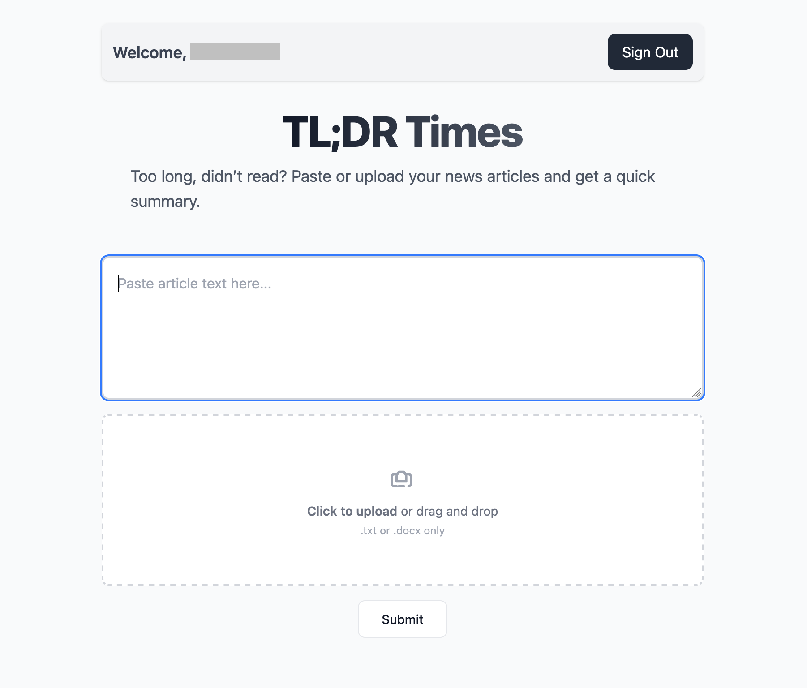

# 📰 TL;DR Times
<p align="center">
    
</p>

TL;DR Times is a web app that takes your news articles and summarises it. 

Built with React and Tailscale as the Frontend, and Python Lambda as the backend.

## Tech Stack
- Front End: React on AWS Amplify
- Back End: AWS API Gateway and AWS Lambda
  - Database: AWS DynamoDB
  - Storage: S3
  - User Management: AWS Amplify and AWS Cognito

## Setting it Up
### Front End
#### Requirements
- node version: v22.16.0
- npm version: 10.9.2
#### Installation
Clone this repository and install the dependencies needed for this project:
```bash
git clone https://github.com/seymouslee/NewsAnalyser.git
cd NewsAnalyser
npm install
```
#### Installing and Setting Up Amplify
Amplify, an AWS service, will be used to manage user sign ups and logins, as well as storage for this web application.
```
npm install -g @aws-amplify/cli
amplify init
amplify add auth # Select "Default Configuration"
amplify add storage # Select "Content", and then "Auth Users Only"
amplify push
```
#### Connect this Application to a Backend
Create a `.env` file in the root directory of this project and fill it:
```
VITE_BACKEND_ENDPOINT=<Your Backend URL here>
```
Please go to the section, [APIs](#apis), to learn more about the Backend API.

## Test Locally
To test the web application on your local machine, run the following command:
```bash
npm run dev
```
You should be able to see the following output:
```text
  VITE v7.0.0  ready in 115 ms

  ➜  Local:   http://localhost:5173/
  ➜  Network: use --host to expose
  ➜  press h + enter to show help
```
Copy and paste the URL in your browser and you should be able to access web page.


## Deployment
To deploy this application to a remote server, run the following command:
```
npm run build
```
It should generate a folder, `./dist`. Upload the contents within this folder to your server, and you should be able to view the web application in your remote server. For this project, I'm using AWS Amplify to host my backend due to its ease of use without much security trade-offs. 

## APIs
### `POST /analyze`
Takes in a news article in the form of raw text input or by referencing a file that has been uploaded onto S3. Returns a summarised article, list of nationalities mentioned, list of people or organisations mentioned.
#### Request
Content-Type: `mulitpart/form-data`

You must include **either**:

| Field     | Type   | Required | Description                                                                 |
|-----------|--------|----------|-----------------------------------------------------------------------------|
| `text`    | string | Optional | Raw textual content of the article.                                         |
| `filedir` | string | Optional | The object key that has been uploaded to the Amplify Bucket                 |

#### Example Request (with Axios)

```js
const formData = new FormData();

// Option 1: Analyze raw text
formData.append('text', 'The Prime Minister of Spain held a press conference...');

// Option 2: Analyze uploaded file in S3
formData.append('filedir', 'private/ap-southeast-1:uuid123/username/news.docx');

const response = await axios.post(
  backendEndpoint
  formData,
  { headers: { 'Content-Type': 'multipart/form-data' } }
);
```

#### Example Response
Status Code: `200 OK`  
Content-Type: `application/json`
```js
{
  "summary": "The Prime Minister of Spain announced...",
  "nationalities": ["Spanish"],
  "entities": ["The Spanish Government"]
}
```

## Limitations and Assumptions
1. No IaC for infrastructure provisioning
2. Organisations/People are one category under the requirements.
3. `.docx` files only contains text (No other elements like pictures)